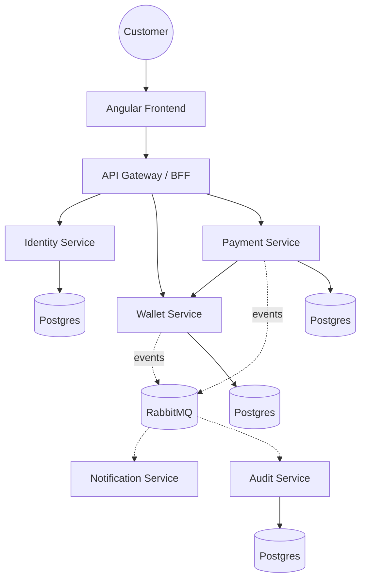
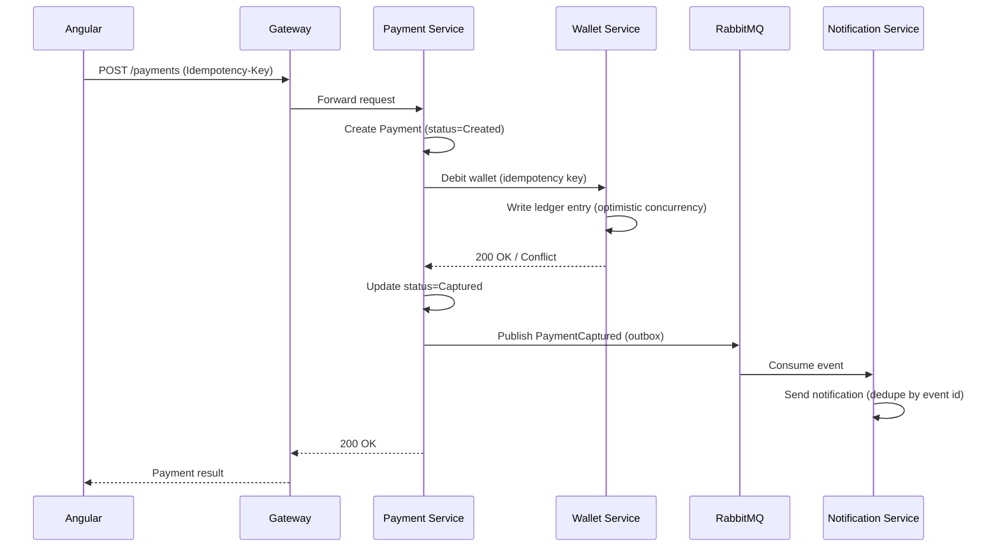
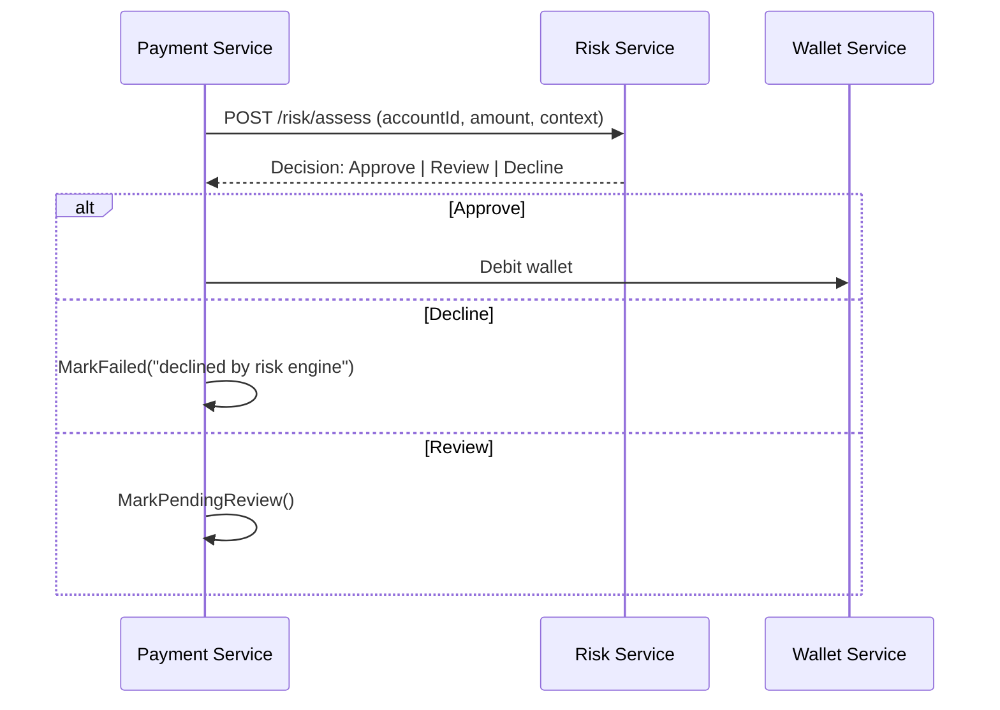

# Enterprise Payment Platform — Complete Build Tutorial

*A step-by-step walkthrough for building the platform described in `Enterprise_Payment_Platform_Developer_Instruction.md`, incorporating the expanded phase breakdown and security model from `Phase4-17_Breakdown_and_Security_Model.md`.*

This tutorial covers all 17 phases at a **build-along depth**: every phase explains what you're building and why, walks through the concrete steps, and includes representative code/config for the patterns that matter most (concurrency-safe wallet ledger, saga orchestration, outbox pattern, K8s manifests, CI/CD pipeline, observability wiring). It does not print every line of every microservice — for repetitive services (e.g. Notification, Audit) it shows the pattern once and tells you where to repeat it.

**How to use this**: work through phases in order. Each phase ends with a "Definition of Done" checklist — don't move on until it's checked off, per the project's own execution rule ("complete one phase at a time, wait for review before beginning the next").

**Documenting your journey**: this project doubles as a capstone, so three companion files are designed to be used alongside every phase, not just at the end:

- `ADR-Template-and-Starter-Log.md` — write an Architecture Decision Record for every meaningful choice as you make it (there's a phase-tagged log of ~15 decision points to work through)
- `Learning-Journal-Template.md` — a per-session devlog format built around explaining each day's core concept simply enough to teach it, plus a running "concepts mastered" checklist
- `Concept-Study-Guide.md` — the underlying CS/engineering theory behind each phase, with a self-test question and canonical reading for each

Treat these as part of the Definition of Done, not optional extras — an ADR written and a journal entry logged for each phase.

---

## Table of Contents

1. [Prerequisites](#prerequisites)
2. [Phase 1 — Architecture & Planning](#phase-1)
3. [Phase 2 — Repository Initialization](#phase-2)
4. [Phase 3 — Local Infrastructure](#phase-3)
5. [Phase 4 — Shared Backend Foundation Libraries](#phase-4)
6. [Phase 5 — Identity Service](#phase-5)
7. [Phase 6 — Wallet Service](#phase-6)
8. [Phase 7 — Payment Service](#phase-7)
9. [Phase 8 — Notification Service](#phase-8)
10. [Phase 9 — Audit Service](#phase-9)
11. [Phase 10 — Angular Frontend](#phase-10)
12. [Phase 11 — Docker Packaging](#phase-11)
13. [Phase 12 — Kubernetes Manifests](#phase-12)
14. [Phase 13 — Helm Charts](#phase-13)
15. [Phase 14 — GitHub Actions CI/CD](#phase-14)
16. [Phase 15 — Observability Stack](#phase-15)
17. [Phase 16 — Security Hardening](#phase-16)
18. [Phase 17 — Comprehensive Testing & Documentation](#phase-17)
19. [Phase 18 — Fraud/Risk Service (extension)](#phase-18)
20. [Phase 19 — Reporting/Analytics Service — CQRS Read Model (extension)](#phase-19)

---

## Prerequisites

Install and verify before starting Phase 1:

| Tool | Purpose | Verify |
|---|---|---|
| .NET 8 SDK | Backend services | `dotnet --version` |
| Node.js 20+ / Angular CLI | Frontend | `ng version` |
| Docker Desktop (or Docker Engine) | Containers | `docker version` |
| kind | Local Kubernetes | `kind version` |
| kubectl | Cluster control | `kubectl version --client` |
| Helm 3 | Chart packaging | `helm version` |
| Git | Version control | `git --version` |
| k6 (later, Phase 17) | Load testing | `k6 version` |

**Hardware note**: running Kind + Postgres + RabbitMQ + Redis + Prometheus + Grafana + Loki + 5 services + Angular concurrently is heavy. 16GB RAM minimum is recommended; on smaller machines, scale down replica counts and consider disabling Loki initially.

---

<a id="phase-1"></a>
## Phase 1 — Architecture & Planning

**Goal**: no code before the system is designed on paper. This is the phase most people skip and regret.

### Steps

1. Create the `/docs` folder at the repo root.
2. Write each of the following as its own markdown file. Keep them short and living — update them as decisions change rather than treating them as write-once.

   - `Architecture.md` — high-level system description, the five services and their responsibilities, how they communicate (sync HTTP via gateway, async via RabbitMQ)
   - `Technology-Decisions.md` — **do not use this as a decision log.** Individual ADRs live in `docs/adr/`, one file per decision, per `ADR-Template-and-Starter-Log.md` — that file already supersedes this one. Keep `Technology-Decisions.md` as a short index only: a table of ADR number, title, phase, and status, updated as each ADR is written. Only decisions that are genuinely fixed *at Phase 1* and don't warrant their own ADR belong here directly — e.g. "microservices over a monolith," "monorepo," "Clean Architecture layering" — anything implementation-specific (which broker, which hashing algorithm, which gateway library) is deferred to its own numbered ADR in the phase where it's actually decided, not written here in Phase 1
   - `Folder-Structure.md` — the monorepo layout (defined in Phase 2)
   - `Coding-Standards.md` — SOLID/Clean Architecture rules, naming conventions, the specific patterns mandated in the main instruction doc (Repository pattern, Options pattern, global exception middleware)
   - `Microservice-Responsibilities.md` — one section per service: owns which data, publishes which events, consumes which events
   - `API-Guidelines.md` — REST conventions, versioning scheme (e.g. `/api/v1/...`), error response shape (RFC 7807 Problem Details), idempotency-key requirements for financial endpoints
   - `Deployment-Strategy.md` — environments (dev/staging/prod), how Helm values differ per environment, rollout strategy (rolling update vs blue/green)
   - `Security-Model.md` — use the outline from the addendum (identity & access, token lifecycle, secrets management, network security, data protection, application security controls, threat modeling, security testing, incident response)
   - `Logging-Strategy.md` — structured logging format, correlation-ID propagation rules, what gets logged at each level
   - `Observability-Strategy.md` — the three pillars (metrics/logs/traces), which tool owns each, SLOs per service
   - `Development-Roadmap.md` — this 17-phase plan, restated as a checklist you can tick off

### Architecture Diagrams (Mermaid)

Store these inside `Architecture.md` or as separate `.mmd` files under `/docs/diagrams`.

**System Context Diagram**



**Sequence Diagram — Payment Flow**



Also produce sequence diagrams for: Login, Wallet Debit (standalone), Refund, JWT Refresh, and Audit Logging, following the same pattern — actor, gateway, target service(s), and any async fan-out.

**Container Diagram**: one box per deployable (Angular, Gateway, 5 services, Postgres instances, RabbitMQ, Redis) showing network boundaries.

**Component Diagram (per microservice)**: for each service, show Controller → Application layer (handlers/use cases) → Domain → Infrastructure (repository, outbox, message publisher). This is where you make Clean Architecture concrete rather than aspirational.

**Deployment Diagram**: Kubernetes namespace layout, which pods talk to which via Services/Ingress, where NetworkPolicies restrict traffic.

### Definition of Done

- [ ] All 11 documents exist in `/docs` with real content (no placeholder text)
- [ ] All required Mermaid diagrams render correctly (test in a Markdown previewer)
- [ ] Every service's responsibility is unambiguous — no two services claim ownership of the same data

---

<a id="phase-2"></a>
## Phase 2 — Repository Initialization

**Goal**: a monorepo structure that scales to 17 phases without needing to be restructured later.

### Suggested Layout

```text
enterprise-payment-platform/
├── docs/
│   ├── diagrams/
│   └── *.md                      # Phase 1 documents
├── scripts/
│   ├── bootstrap.sh
│   └── bootstrap.ps1
├── src/
│   ├── BuildingBlocks/
│   │   ├── BuildingBlocks.Common/
│   │   ├── BuildingBlocks.Messaging/
│   │   ├── BuildingBlocks.Observability/
│   │   └── BuildingBlocks.Security/
│   ├── Services/
│   │   ├── Identity/
│   │   │   ├── Identity.Api/
│   │   │   ├── Identity.Application/
│   │   │   ├── Identity.Domain/
│   │   │   ├── Identity.Infrastructure/
│   │   │   └── Identity.Tests/
│   │   ├── Wallet/            # same sub-structure
│   │   ├── Payment/           # same sub-structure
│   │   ├── Notification/      # same sub-structure
│   │   └── Audit/             # same sub-structure
│   ├── Gateway/
│   │   └── Gateway.Api/        # YARP/Ocelot BFF
│   └── Frontend/
│       └── payment-platform-ui/   # Angular app
├── deploy/
│   ├── k8s/                    # raw manifests, Phase 12
│   └── helm/                   # charts, Phase 13
├── .github/
│   └── workflows/               # CI/CD, Phase 14
├── PaymentPlatform.sln
└── README.md
```

### Steps

1. `git init`, add a `.gitignore` covering .NET (`bin/`, `obj/`), Node (`node_modules/`, `dist/`), and IDE files.
2. Create the solution: `dotnet new sln -n PaymentPlatform`.
3. Scaffold each service as Clean Architecture layers (`dotnet new webapi`, `classlib` × 3) and add all projects to the `.sln`.
4. Scaffold the Angular app: `ng new payment-platform-ui --routing --style=scss`.
5. Commit as the initial skeleton. This is the first commit that should exist — everything in Phase 1 can live in the same commit or precede it.

### Definition of Done

- [ ] `dotnet build` succeeds across the whole solution (even with near-empty services)
- [ ] `ng build` succeeds for the frontend skeleton
- [ ] Folder structure matches `Folder-Structure.md` exactly (update the doc if you deviate)

---

<a id="phase-3"></a>
## Phase 3 — Local Infrastructure

**Goal**: one command spins up everything needed to run the platform locally.

### Steps

1. Write `scripts/bootstrap.sh` (and a `.ps1` equivalent) that:
   - Creates a Kind cluster with a config exposing ports for Ingress
   - Installs NGINX Ingress via Helm
   - Installs RabbitMQ, Redis, and Postgres (via Helm charts or Bitnami charts) into a `platform` namespace
   - Installs Metrics Server, Prometheus, Grafana, and Loki (kube-prometheus-stack + loki-stack Helm charts)
   - Creates namespaces (`platform`, `monitoring`, `ingress-nginx`)
   - Creates a StorageClass appropriate for Kind (`standard` with `rancher.io/local-path`)
   - Generates initial Secrets (DB passwords, RabbitMQ credentials) — for local dev these can be plain K8s Secrets; note in `Security-Model.md` that production would use external-secrets/Vault instead

Example skeleton (`bootstrap.sh`):

```bash
#!/usr/bin/env bash
set -euo pipefail

CLUSTER_NAME="payment-platform"

echo "==> Creating Kind cluster"
kind create cluster --name "$CLUSTER_NAME" --config kind-config.yaml

echo "==> Creating namespaces"
kubectl create namespace platform --dry-run=client -o yaml | kubectl apply -f -
kubectl create namespace monitoring --dry-run=client -o yaml | kubectl apply -f -

echo "==> Installing NGINX Ingress"
helm upgrade --install ingress-nginx ingress-nginx \
  --repo https://kubernetes.github.io/ingress-nginx \
  --namespace ingress-nginx --create-namespace

echo "==> Installing infra: Postgres, RabbitMQ, Redis"
helm upgrade --install postgres bitnami/postgresql -n platform -f infra/postgres-values.yaml
helm upgrade --install rabbitmq bitnami/rabbitmq -n platform -f infra/rabbitmq-values.yaml
helm upgrade --install redis bitnami/redis -n platform -f infra/redis-values.yaml

echo "==> Installing observability stack"
helm upgrade --install kube-prometheus-stack prometheus-community/kube-prometheus-stack -n monitoring --create-namespace
helm upgrade --install loki grafana/loki-stack -n monitoring

echo "==> Bootstrap complete"
```

2. Document required environment variables / secrets in `docs/Deployment-Strategy.md`.
3. Add a `scripts/teardown.sh` counterpart (`kind delete cluster --name payment-platform`) — you'll use it often.

### Definition of Done

- [ ] `./scripts/bootstrap.sh` runs clean on a fresh machine
- [ ] `kubectl get pods -A` shows all infra pods Running
- [ ] Grafana and RabbitMQ management UI are reachable via port-forward or Ingress
- [ ] Teardown script cleanly removes the cluster

---

<a id="phase-4"></a>
## Phase 4 — Shared Backend Foundation Libraries

**Goal**: every service should import cross-cutting concerns instead of reimplementing them. Build these four libraries before touching any service.

### `BuildingBlocks.Common`

Key pieces: a `Result<T>` type so handlers return explicit success/failure instead of throwing for control flow, and Problem Details middleware so every service returns RFC 7807-shaped errors.

```csharp
public class Result<T>
{
    public bool IsSuccess { get; }
    public T? Value { get; }
    public string? Error { get; }

    private Result(bool isSuccess, T? value, string? error)
        => (IsSuccess, Value, Error) = (isSuccess, value, error);

    public static Result<T> Success(T value) => new(true, value, null);
    public static Result<T> Failure(string error) => new(false, default, error);
}

// Global exception + Problem Details middleware
app.UseExceptionHandler(errApp => errApp.Run(async context =>
{
    var feature = context.Features.Get<IExceptionHandlerFeature>();
    var problem = new ProblemDetails
    {
        Status = StatusCodes.Status500InternalServerError,
        Title = "An unexpected error occurred",
        Detail = feature?.Error.Message,
        Instance = context.TraceIdentifier
    };
    context.Response.StatusCode = problem.Status.Value;
    await context.Response.WriteAsJsonAsync(problem);
}));
```

Also include: correlation-ID middleware (reads/generates `X-Correlation-Id`, pushes it into the logging scope), FluentValidation base validators, and strongly-typed configuration helpers (`IOptions<T>` extension methods that validate on startup, not on first use).

### `BuildingBlocks.Messaging`

The most important piece here is the **outbox pattern** — write the event to the same database transaction as the business change, then a background dispatcher publishes it to RabbitMQ. This guarantees you never lose an event because the broker was down.

```csharp
public class OutboxMessage
{
    public Guid Id { get; set; }
    public string Type { get; set; } = default!;
    public string Payload { get; set; } = default!;
    public DateTime OccurredAtUtc { get; set; }
    public DateTime? ProcessedAtUtc { get; set; }
}

// Inside a command handler, in the same DbContext.SaveChangesAsync() transaction:
_db.OutboxMessages.Add(new OutboxMessage
{
    Id = Guid.NewGuid(),
    Type = nameof(WalletDebited),
    Payload = JsonSerializer.Serialize(new WalletDebited(accountId, amount, correlationId)),
    OccurredAtUtc = DateTime.UtcNow
});
await _db.SaveChangesAsync(); // ledger entry + outbox row commit atomically
```

A hosted `BackgroundService` polls unprocessed outbox rows on an interval, publishes each to RabbitMQ, and marks it processed. On the consumer side, add a `ProcessedEventIds` table so handlers are idempotent under RabbitMQ's at-least-once delivery.

### `BuildingBlocks.Observability`

Wire OpenTelemetry once here so every service gets it by referencing the package:

```csharp
services.AddOpenTelemetry()
    .WithTracing(tracing => tracing
        .AddAspNetCoreInstrumentation()
        .AddHttpClientInstrumentation()
        .AddNpgsql()
        .AddOtlpExporter())
    .WithMetrics(metrics => metrics
        .AddAspNetCoreInstrumentation()
        .AddRuntimeInstrumentation()
        .AddPrometheusExporter());
```

Add a shared `/health` endpoint convention (liveness vs readiness) using `Microsoft.Extensions.Diagnostics.HealthChecks`, with each service adding its own DB/broker checks.

### `BuildingBlocks.Security`

JWT bearer validation configured once, plus a claims-based `[RequirePermission("wallet:debit")]` attribute pattern so authorization logic isn't copy-pasted per service.

### Definition of Done

- [ ] All four libraries build and have unit tests
- [ ] Each has a README documenting its public contract
- [ ] A throwaway "ping" service references all four and boots successfully

---

<a id="phase-5"></a>
## Phase 5 — Identity Service

**Goal**: authentication/authorization for the whole platform. Get this right once — every other service trusts its tokens.

### Steps

1. **Domain**: `User` aggregate (email, password hash, roles), `RefreshToken` entity (token hash, expiry, revoked flag, replaced-by pointer for rotation tracking).
2. **Password hashing**: use `Microsoft.AspNetCore.Identity.PasswordHasher<T>` (PBKDF2) or Argon2id via a library like `Konscious.Security.Cryptography` — never roll your own.
3. **Token issuance**: short-lived access token (10–15 min) + long-lived refresh token (7–14 days), refresh token stored hashed in the DB (never store it plain).

```csharp
public async Task<Result<TokenPair>> RefreshAsync(string refreshToken)
{
    var hashed = Hash(refreshToken);
    var existing = await _db.RefreshTokens.SingleOrDefaultAsync(t => t.TokenHash == hashed);

    if (existing is null || existing.Revoked || existing.ExpiresAtUtc < DateTime.UtcNow)
        return Result<TokenPair>.Failure("Invalid or expired refresh token");

    // Rotation: revoke the old token, issue a new pair, chain them for audit
    existing.Revoked = true;
    var newPair = await IssueTokenPairAsync(existing.UserId);
    existing.ReplacedByTokenHash = Hash(newPair.RefreshToken);
    await _db.SaveChangesAsync();

    return Result<TokenPair>.Success(newPair);
}
```

4. **Claims**: embed `sub`, `role`, and a `permissions` claim array so the Gateway/services can authorize without a round trip.
5. Expose OpenAPI (`Swashbuckle`) so the Gateway and frontend have a contract to code against.
6. EF Core migrations for `Users`, `RefreshTokens`.

### Testing

Use Testcontainers to spin up a real Postgres for integration tests rather than mocking the DbContext — token rotation logic is exactly the kind of thing that looks correct against an in-memory provider and breaks against real constraints.

### Definition of Done

- [ ] Register/login/refresh/logout all work end-to-end against a real Postgres
- [ ] Refresh token rotation revokes the old token (verify a reused old token is rejected)
- [ ] Health, metrics, structured logging wired via BuildingBlocks
- [ ] Short threat-model note added to `Security-Model.md` covering brute-force protection (rate limit login attempts) and token theft mitigation (rotation + revocation)

---

<a id="phase-6"></a>
## Phase 6 — Wallet Service

**Goal**: this is the highest-risk service in the platform. Money must never be created or destroyed by a bug.

### Ledger Design

Do not store a mutable `Balance` column. Store immutable ledger entries and compute balance as a query:

```csharp
public class LedgerEntry
{
    public Guid Id { get; set; }
    public Guid AccountId { get; set; }
    public decimal Amount { get; set; }       // positive = credit, negative = debit
    public string Reference { get; set; } = default!;   // e.g. payment id
    public string IdempotencyKey { get; set; } = default!;
    public DateTime OccurredAtUtc { get; set; }
}

public class Account
{
    public Guid Id { get; set; }
    public Guid OwnerId { get; set; }
    public byte[] RowVersion { get; set; } = default!;   // optimistic concurrency token
}
```

```csharp
public async Task<Result<decimal>> DebitAsync(Guid accountId, decimal amount, string idempotencyKey, string reference)
{
    // Idempotency check first — a retried request must be a no-op, not a double debit
    if (await _db.LedgerEntries.AnyAsync(e => e.IdempotencyKey == idempotencyKey))
        return Result<decimal>.Success(await GetBalanceAsync(accountId));

    var account = await _db.Accounts.SingleAsync(a => a.Id == accountId);
    var balance = await GetBalanceAsync(accountId);

    if (balance < amount)
        return Result<decimal>.Failure("Insufficient funds");

    _db.LedgerEntries.Add(new LedgerEntry
    {
        Id = Guid.NewGuid(), AccountId = accountId, Amount = -amount,
        Reference = reference, IdempotencyKey = idempotencyKey, OccurredAtUtc = DateTime.UtcNow
    });

    try
    {
        await _db.SaveChangesAsync(); // RowVersion mismatch throws DbUpdateConcurrencyException
    }
    catch (DbUpdateConcurrencyException)
    {
        return Result<decimal>.Failure("Concurrent modification — retry");
    }

    return Result<decimal>.Success(balance - amount);
}
```

### Concurrency Test (write this — don't skip it)

Fire N parallel debits against the same account that would overdraw it if run sequentially-unsafe, and assert exactly the correct number succeed. This is the single most important test in the whole platform.

### Reconciliation

Add a scheduled job (or on-demand endpoint) that sums `LedgerEntries` per account and compares to any cached/materialized balance view — if they ever diverge, that's a P1 bug, not a warning.

### Definition of Done

- [ ] Parallel-debit concurrency test passes consistently (run it 20+ times, not once)
- [ ] Idempotency-key replay test passes (same key, same request twice → one ledger entry)
- [ ] Reconciliation report matches ledger sums exactly
- [ ] `WalletDebited`/`WalletCredited` events published via outbox

---

<a id="phase-7"></a>
## Phase 7 — Payment Service

**Goal**: orchestrate Wallet + Notification without losing consistency when a step fails midway.

### State Machine

`Created → Authorized → Captured → Settled` (happy path), with `Failed` and `Refunded` as terminal/branch states. Model this explicitly rather than as a free-text status string — an enum plus a guard method that rejects illegal transitions.

### Saga (Orchestration Style)

Recommended over choreography for this use case: a single Payment service coordinates, which makes failure handling and the sequence diagrams from Phase 1 much easier to reason about than a web of services each reacting to each other's events.

```csharp
public async Task<Result<Payment>> CapturePaymentAsync(CapturePaymentCommand cmd)
{
    var payment = await _repo.GetAsync(cmd.PaymentId);
    payment.MarkAuthorized();

    var debitResult = await _walletClient.DebitAsync(
        payment.AccountId, payment.Amount, idempotencyKey: cmd.IdempotencyKey.ToString(), reference: payment.Id.ToString());

    if (debitResult.IsFailure)
    {
        payment.MarkFailed(debitResult.Error!);
        await _repo.SaveAsync(payment);
        return Result<Payment>.Failure(debitResult.Error!);
    }

    payment.MarkCaptured();
    await _repo.SaveAsync(payment);          // includes outbox write for PaymentCaptured
    return Result<Payment>.Success(payment);
}
```

Wrap the `_walletClient` call in a Polly policy: retry on transient network errors, circuit-break after repeated failures, and fall back to marking the payment `Failed` (never leave it stuck in `Authorized`).

```csharp
services.AddHttpClient<IWalletClient, WalletClient>()
    .AddTransientHttpErrorPolicy(p => p.WaitAndRetryAsync(3, i => TimeSpan.FromMilliseconds(200 * i)))
    .AddTransientHttpErrorPolicy(p => p.CircuitBreakerAsync(5, TimeSpan.FromSeconds(30)));
```

### Fault-Injection Test

Kill (or stub a 500 from) the Wallet service mid-flow and assert the Payment service transitions to `Failed` rather than hanging in `Authorized` indefinitely. This is your saga's most important test, analogous to Phase 6's concurrency test.

### Definition of Done

- [ ] All state transitions enforced (illegal transitions throw/reject)
- [ ] `Idempotency-Key` header required and enforced on `POST /payments`
- [ ] Fault-injection test proves no stuck-in-progress payments
- [ ] Contract tests against Wallet and Notification pass

---

<a id="phase-8"></a>
## Phase 8 — Notification Service

**Goal**: consume domain events and deliver notifications without duplicating them.

### Steps

1. RabbitMQ consumer subscribed to `PaymentCaptured`, `PaymentFailed`, `WalletDebited` (whichever are relevant to notify on).
2. **Idempotent consumption** — before processing, check a `ProcessedEvents(EventId)` table; if present, ack and skip.

```csharp
public async Task HandleAsync(PaymentCaptured evt)
{
    if (await _db.ProcessedEvents.AnyAsync(e => e.EventId == evt.EventId))
        return; // already handled — RabbitMQ at-least-once delivery means this will happen

    await _templateEngine.RenderAndSendAsync("payment-captured", evt);
    _db.ProcessedEvents.Add(new ProcessedEvent { EventId = evt.EventId, ProcessedAtUtc = DateTime.UtcNow });
    await _db.SaveChangesAsync();

    await _auditClient.LogAsync("Notification.Sent", evt.EventId, evt.CorrelationId);
}
```

3. Template engine can be as simple as Scriban or Razor templates for mocked email/SMS bodies — this is a simulation, no real delivery provider is required unless you want to wire one (e.g. a sandbox SendGrid key).
4. Configure a dead-letter queue and an alert on DLQ depth > 0.

### Definition of Done

- [ ] Publishing the same event twice results in exactly one notification
- [ ] DLQ receives messages that fail after retry exhaustion, and is monitored
- [ ] Every send is recorded to the Audit Service

---

<a id="phase-9"></a>
## Phase 9 — Audit Service

**Goal**: an immutable, queryable record of everything that happened, independent of any other service's database.

### Steps

1. Append-only `AuditEntries` table — no `UPDATE`/`DELETE` permission granted to the service's own DB role at the database level, not just application-level convention.
2. Consume domain events from all services (via RabbitMQ, same idempotent-consumer pattern as Phase 8).
3. Expose a paginated, filterable query API (`GET /audit?entityId=&type=&from=&to=`).
4. Optional: hash-chain entries (`hash(entry) = SHA256(entry + previousHash)`) so tampering is detectable, even if not cryptographically bulletproof for a simulation.

```csharp
public class AuditEntry
{
    public Guid Id { get; set; }
    public string EventType { get; set; } = default!;
    public string EntityId { get; set; } = default!;
    public string Payload { get; set; } = default!;
    public string CorrelationId { get; set; } = default!;
    public DateTime OccurredAtUtc { get; set; }
    public string? PreviousHash { get; set; }
    public string Hash { get; set; } = default!;
}
```

### Definition of Done

- [ ] Every domain event published anywhere in the platform lands in the Audit log
- [ ] Query API paginates correctly under realistic volume (seed 50k+ rows and check response times)
- [ ] Retention policy documented (even if "keep forever" for the simulation)

---

<a id="phase-10"></a>
## Phase 10 — Angular Frontend

**Goal**: one coherent client backed by a single origin (the Gateway), not five separately-CORS'd services.

### Steps

1. **Gateway/BFF first**: stand up a YARP (or Ocelot) reverse proxy that routes `/api/identity/*`, `/api/wallet/*`, `/api/payments/*` to the respective services. The Angular app only ever talks to the Gateway.

```csharp
// Gateway.Api Program.cs (YARP)
builder.Services.AddReverseProxy()
    .LoadFromConfig(builder.Configuration.GetSection("ReverseProxy"));
// appsettings.json defines routes/clusters mapping /api/wallet/{**catch-all} -> wallet-service
```

2. **Project structure**: feature modules (`auth/`, `wallet/`, `payments/`), a `core/` module for the auth interceptor and error interceptor, `shared/` for reusable UI.
3. **Auth interceptor** — attach the access token, and on 401, attempt a silent refresh once before failing:

```typescript
export const authInterceptor: HttpInterceptorFn = (req, next) => {
  const auth = inject(AuthService);
  const authedReq = req.clone({ setHeaders: { Authorization: `Bearer ${auth.accessToken()}` } });

  return next(authedReq).pipe(
    catchError(err => {
      if (err.status === 401) {
        return auth.refresh().pipe(
          switchMap(() => next(req.clone({ setHeaders: { Authorization: `Bearer ${auth.accessToken()}` } })))
        );
      }
      return throwError(() => err);
    })
  );
};
```

4. **State management**: Angular signals are sufficient for this scope (five services, no deeply nested shared state) — reach for NgRx only if state complexity grows beyond what signals comfortably handle. This is ADR-0009 — write it now, in `docs/adr/`, using your own reasoning about the trade-off.
5. **E2E tests** (Playwright): cover login → view wallet balance → make a payment → see updated balance, as the one true happy-path smoke test.
6. **Accessibility**: run `axe-core` against key pages, fix contrast/label issues, aim for WCAG AA on forms (login, payment).

### Definition of Done

- [ ] Frontend talks only to the Gateway — no direct calls to individual services
- [ ] Silent token refresh works without logging the user out on a 401
- [ ] Playwright happy-path suite green in CI
- [ ] No critical `axe-core` violations on login/wallet/payment pages

---

<a id="phase-11"></a>
## Phase 11 — Docker Packaging

**Goal**: small, non-root, scanned images for every deployable.

### Example Multi-Stage Dockerfile (.NET service)

```dockerfile
FROM mcr.microsoft.com/dotnet/sdk:8.0 AS build
WORKDIR /src
COPY . .
RUN dotnet restore "Services/Wallet/Wallet.Api/Wallet.Api.csproj"
RUN dotnet publish "Services/Wallet/Wallet.Api/Wallet.Api.csproj" -c Release -o /app --no-restore

FROM mcr.microsoft.com/dotnet/aspnet:8.0-alpine AS runtime
RUN addgroup -S appgroup && adduser -S appuser -G appgroup
WORKDIR /app
COPY --from=build /app .
USER appuser
EXPOSE 8080
ENTRYPOINT ["dotnet", "Wallet.Api.dll"]
```

### Example Dockerfile (Angular)

```dockerfile
FROM node:20-alpine AS build
WORKDIR /app
COPY package*.json ./
RUN npm ci
COPY . .
RUN npm run build -- --configuration production

FROM nginx:1.27-alpine
COPY --from=build /app/dist/payment-platform-ui/browser /usr/share/nginx/html
COPY nginx.conf /etc/nginx/conf.d/default.conf
```

### Steps

1. Add a `Trivy` scan step for every image (locally: `trivy image wallet-service:local`).
2. Set an image size budget per service (e.g. < 150MB for .NET alpine images) and track it — size creep is a slow leak.
3. Tag images with git SHA, not just `latest`, so Helm can pin exact versions.

### Definition of Done

- [ ] Every service has a working multi-stage Dockerfile, runs as non-root
- [ ] Trivy reports zero unresolved critical CVEs
- [ ] Images tagged with commit SHA and pushed to a registry (local registry is fine for Kind)

---

<a id="phase-12"></a>
## Phase 12 — Kubernetes Manifests

**Goal**: declarative, least-privilege deployment definitions for everything built so far.

### Example Deployment + Service (Wallet)

```yaml
apiVersion: apps/v1
kind: Deployment
metadata:
  name: wallet-service
  namespace: platform
spec:
  replicas: 2
  selector:
    matchLabels: { app: wallet-service }
  template:
    metadata:
      labels: { app: wallet-service }
    spec:
      containers:
        - name: wallet-service
          image: registry.local/wallet-service:GIT_SHA
          ports: [{ containerPort: 8080 }]
          resources:
            requests: { cpu: "100m", memory: "128Mi" }
            limits: { cpu: "500m", memory: "256Mi" }
          readinessProbe:
            httpGet: { path: /health/ready, port: 8080 }
            initialDelaySeconds: 5
          livenessProbe:
            httpGet: { path: /health/live, port: 8080 }
            initialDelaySeconds: 10
          envFrom:
            - secretRef: { name: wallet-service-secrets }
---
apiVersion: v1
kind: Service
metadata:
  name: wallet-service
  namespace: platform
spec:
  selector: { app: wallet-service }
  ports: [{ port: 80, targetPort: 8080 }]
```

### Also Add

- **HorizontalPodAutoscaler** per service (CPU-based to start; add custom-metric scaling later if needed)
- **PodDisruptionBudget** (`minAvailable: 1`) so voluntary disruptions don't take a service fully offline
- **NetworkPolicy** restricting, e.g., only the Gateway and Payment service may reach Wallet — Notification and Audit should not be able to call Wallet directly
- **Secrets** via `sealed-secrets` or `external-secrets` rather than committing raw K8s Secret YAML to git, even for a local simulation — build the habit now

### Definition of Done

- [ ] `kubeconform` passes against all manifests
- [ ] Manifests apply cleanly to the Kind cluster from Phase 3
- [ ] NetworkPolicy verified by attempting (and failing) a disallowed service-to-service call

---

<a id="phase-13"></a>
## Phase 13 — Helm Charts

**Goal**: package Phase 12's manifests so they're parameterized per environment instead of hand-edited.

### Structure

```text
deploy/helm/
├── payment-platform/            # umbrella chart
│   ├── Chart.yaml
│   ├── values.yaml
│   ├── values-dev.yaml
│   ├── values-staging.yaml
│   ├── values-prod.yaml
│   └── charts/
│       ├── wallet-service/
│       ├── payment-service/
│       ├── identity-service/
│       ├── notification-service/
│       ├── audit-service/
│       └── gateway/
```

Each subchart templates the Deployment/Service/HPA/PDB from Phase 12, parameterizing image tag, replica count, and resource limits via `values.yaml`. The umbrella chart's `values-dev.yaml` might set `replicas: 1` and relaxed resource limits; `values-prod.yaml` sets `replicas: 3` and stricter limits plus `podAntiAffinity`.

### Steps

1. `helm create wallet-service` as a starting scaffold, then strip the boilerplate you don't need.
2. Parameterize image repository + tag so CI can inject the exact git-SHA-tagged image built in Phase 11.
3. Add golden-file tests: `helm template` output committed to a `tests/golden/` folder, diffed in CI so unintended chart drift is caught.

### Definition of Done

- [ ] `helm lint` passes with zero errors across all charts
- [ ] `helm template` renders valid manifests for dev/staging/prod value files
- [ ] `ct lint` (chart-testing) passes in CI

---

<a id="phase-14"></a>
## Phase 14 — GitHub Actions CI/CD

**Goal**: automate the PR checklist already defined in the main instruction doc (unit tests, integration tests, Docker build, K8s manifest validation, Helm lint, docs updated, no compiler warnings).

### Example Workflow Skeleton

```yaml
name: ci
on:
  pull_request:
    branches: [main]

jobs:
  build-test:
    runs-on: ubuntu-latest
    steps:
      - uses: actions/checkout@v4
      - uses: actions/setup-dotnet@v4
        with: { dotnet-version: '8.0.x' }
      - run: dotnet build --warnaserror
      - run: dotnet test --collect:"XPlat Code Coverage"

  frontend:
    runs-on: ubuntu-latest
    steps:
      - uses: actions/checkout@v4
      - uses: actions/setup-node@v4
        with: { node-version: '20' }
      - run: npm ci
        working-directory: src/Frontend/payment-platform-ui
      - run: npm run build -- --configuration production
        working-directory: src/Frontend/payment-platform-ui
      - run: npx playwright test
        working-directory: src/Frontend/payment-platform-ui

  docker-scan:
    needs: [build-test]
    runs-on: ubuntu-latest
    steps:
      - uses: actions/checkout@v4
      - run: docker build -t wallet-service:${{ github.sha }} -f src/Services/Wallet/Dockerfile .
      - uses: aquasecurity/trivy-action@master
        with: { image-ref: 'wallet-service:${{ github.sha }}', severity: 'CRITICAL,HIGH', exit-code: '1' }

  helm-validate:
    runs-on: ubuntu-latest
    steps:
      - uses: actions/checkout@v4
      - uses: azure/setup-helm@v4
      - run: helm lint deploy/helm/payment-platform
      - run: helm template deploy/helm/payment-platform | kubeconform -strict

  deploy-prod:
    needs: [build-test, frontend, docker-scan, helm-validate]
    if: github.ref == 'refs/heads/main'
    environment: production   # requires manual approval via GitHub Environments
    runs-on: [self-hosted, payment-platform]
    steps:
      - run: helm upgrade --install payment-platform deploy/helm/payment-platform -f values-prod.yaml
```

### Steps

1. Set up the self-hosted runner only once Phases 4–13 exist to actually build/test — don't provision it speculatively.
2. Configure branch protection on `main`: require the CI workflow to pass, require at least one review (even self-review checklist for a solo project), block force-push.
3. Use GitHub Environments with required reviewers for the `production` deploy job — this is your "manual approval gate."
4. Document the rollback procedure (`helm rollback payment-platform <revision>`) and rehearse it once.

### Definition of Done

- [ ] A sample PR runs the full pipeline green end-to-end
- [ ] Prod deploy requires manual approval and is separate from the PR pipeline
- [ ] Rollback has been executed at least once against a real (if trivial) bad deploy

---

<a id="phase-15"></a>
## Phase 15 — Observability Stack

**Goal**: make a running incident explainable in minutes, not hours.

### Metrics (Prometheus + Grafana)

Each service already exports Prometheus metrics via `BuildingBlocks.Observability` (Phase 4). Build one Grafana dashboard per service using the **RED method**: Rate, Errors, Duration. Add one platform-wide dashboard showing the same three metrics aggregated, plus RabbitMQ queue depth and Postgres connection pool saturation.

### Logs (Loki)

Every log line already carries a correlation ID (Phase 4 middleware). In Grafana Explore, a LogQL query like:

```logql
{namespace="platform"} | json | correlation_id="abc-123"
```

...should return every log line across all five services for a single request. If it doesn't, the correlation-ID propagation from Phase 4 has a gap — fix it here, don't defer it.

### Traces (OpenTelemetry → Tempo or Jaeger)

This was missing from the original plan despite the plan requiring multi-service sequence diagrams — add it now. Deploy Tempo (or Jaeger) via Helm, point the OTLP exporter configured in Phase 4 at it.

```yaml
# appsettings values injected via Helm
OpenTelemetry:
  Otlp:
    Endpoint: http://tempo.monitoring.svc.cluster.local:4317
```

**Verification**: trigger a full payment flow from the Angular app, then find the trace in Tempo/Jaeger and confirm you see spans for Gateway → Payment → Wallet → (async) → Notification, all under one trace ID. This single trace is the best proof that Phases 4–9's plumbing actually works together.

### Alerting

Alertmanager rules for: error rate > threshold over 5 min, p95 latency > SLO, RabbitMQ DLQ depth > 0, Postgres connections near pool limit. Route to a webhook or email for the simulation — the point is proving the rule fires, not the delivery channel.

### Definition of Done

- [ ] One Grafana dashboard per service (RED) plus one platform-wide dashboard
- [ ] A single correlation ID retrieves logs across all services in one Loki query
- [ ] A single trace spans Gateway → Payment → Wallet → Notification for one payment request
- [ ] At least one alert rule has been manually triggered and confirmed to fire

---

<a id="phase-16"></a>
## Phase 16 — Security Hardening

**Goal**: close the gaps between "runs" and "production-inspired," using the `Security-Model.md` outline as your checklist.

### Steps

1. **Threat modeling**: a lightweight STRIDE pass per service — a table of (Threat category → Scenario → Mitigation) is enough; don't over-engineer the format. Prioritize Wallet and Payment first.
2. **Dependency scanning**: enable Dependabot (or Snyk) on the repo for both NuGet and npm packages.
3. **Secrets scanning**: add `gitleaks` (or GitHub's built-in secret scanning) as a CI step — fail the build if a credential pattern is detected.
4. **Rate limiting**: add ASP.NET Core's built-in rate limiter at the Gateway, especially on `/auth/login` and `/payments` endpoints.

```csharp
builder.Services.AddRateLimiter(options =>
{
    options.AddFixedWindowLimiter("login", opt =>
    {
        opt.PermitLimit = 5;
        opt.Window = TimeSpan.FromMinutes(1);
    });
});
```

5. **mTLS between services** — optional stretch goal via a service mesh (Linkerd is lighter-weight than Istio for a project this size). Don't block on this; NetworkPolicies from Phase 12 already provide meaningful isolation without it.
6. **OWASP ZAP baseline scan**: run against the Gateway's exposed endpoints (`docker run zaproxy/zap-stable zap-baseline.py -t http://gateway.local`), triage findings, fix or explicitly accept-and-document each one.

### Definition of Done

- [ ] STRIDE notes exist for Wallet, Payment, and Identity at minimum
- [ ] Dependabot/Snyk and gitleaks are active in CI
- [ ] Rate limiting verified (6th login attempt in a minute is rejected)
- [ ] ZAP baseline scan has no unresolved high-severity findings

---

<a id="phase-17"></a>
## Phase 17 — Comprehensive Testing & Documentation

**Goal**: prove the system holds up under load and failure, and leave it usable by someone who isn't you in six months.

### Test Pyramid

Document target ratios, e.g.: many unit tests (fast, per-handler), a solid layer of integration tests (Testcontainers, per-service against real Postgres/RabbitMQ), a handful of contract tests (Pact or similar, verifying Payment's assumptions about Wallet's API don't drift), and a thin layer of e2e tests (the Playwright happy path from Phase 10).

### Load Testing (k6)

```javascript
import http from 'k6/http';
import { check } from 'k6';

export const options = { vus: 50, duration: '2m' };

export default function () {
  const res = http.post('https://gateway.local/api/payments', JSON.stringify({
    accountId: 'test-account', amount: 10.00
  }), {
    headers: { 'Content-Type': 'application/json', 'Idempotency-Key': `${__VU}-${__ITER}` }
  });
  check(res, { 'status is 200': (r) => r.status === 200 });
}
```

Set an explicit SLA target (e.g. p95 < 300ms at 50 concurrent users) and treat a failed load test as a blocking issue, not a nice-to-know.

### Chaos Testing

Manually (or via a tool like `chaos-mesh` if you want to invest further) kill a Wallet pod mid-load-test and confirm: the HPA/ReplicaSet replaces it, in-flight requests either retry successfully or fail gracefully (no stuck `Authorized` payments — this is Phase 7's fault-injection test, now under real load).

### Documentation Close-Out

Refresh every Phase 1 document to match what was actually built (architecture docs drift during implementation — this is normal, but they must be corrected before calling the project done). Write operational runbooks:

- **On-call runbook**: how to check service health, where dashboards/traces live, common failure modes and their fixes
- **Incident response runbook**: severity levels, communication steps, postmortem template (the `engineering:incident-response` skill pattern is a good reference)
- **Backup/restore runbook**: how Postgres backups are taken (even if just `pg_dump` on a cron for the simulation) and how a restore is verified

### Definition of Done

- [ ] Load test meets the agreed SLA
- [ ] Chaos test confirms no stuck payments under pod failure + load
- [ ] All Phase 1 docs updated to reflect final implementation
- [ ] Runbooks exist and have each been dry-run once end-to-end

---

---

<a id="phase-18"></a>
## Phase 18 — Fraud/Risk Service *(extension)*

**Goal**: insert a real risk-scoring step into the payment saga, teaching rules-engine design and a second, distinct flavor of saga step — a synchronous gate-check rather than an async side-effect.

### Where it fits

Extend the Payment state machine: `Created → RiskAssessed → Authorized → Captured`. The Risk check happens *before* the Wallet debit, since there's no point debiting an account for a transaction you're about to decline.



### Domain Model

```csharp
public class RiskAssessment
{
    public Guid Id { get; set; }
    public Guid PaymentId { get; set; }
    public RiskDecision Decision { get; set; }   // Approve, Review, Decline
    public int Score { get; set; }
    public List<string> MatchedRules { get; set; } = new();
}

public interface IRiskRule
{
    Task<RuleResult> EvaluateAsync(RiskContext ctx);
}
```

### Example Rules

A rules engine here doesn't need to be a generic framework — three or four concrete rules teach the pattern just as well as twenty:

```csharp
public class VelocityRule : IRiskRule
{
    public async Task<RuleResult> EvaluateAsync(RiskContext ctx)
    {
        var recentCount = await _paymentHistory.CountRecentAsync(ctx.AccountId, TimeSpan.FromMinutes(10));
        return recentCount > 5
            ? RuleResult.Flag("velocity", weight: 40, "More than 5 payments in 10 minutes")
            : RuleResult.Pass();
    }
}

public class LargeAmountRule : IRiskRule
{
    public Task<RuleResult> EvaluateAsync(RiskContext ctx) =>
        Task.FromResult(ctx.Amount > 5000m
            ? RuleResult.Flag("large-amount", weight: 30, "Amount exceeds standard threshold")
            : RuleResult.Pass());
}

public class FirstTimePayeeRule : IRiskRule
{
    public async Task<RuleResult> EvaluateAsync(RiskContext ctx)
    {
        var hasHistory = await _paymentHistory.HasPriorPaymentsToAsync(ctx.AccountId, ctx.PayeeId);
        return !hasHistory
            ? RuleResult.Flag("first-time-payee", weight: 15, "No prior payment history to this payee")
            : RuleResult.Pass();
    }
}
```

Aggregate: sum matched-rule weights into a score; score bands map to `Approve` (< 30), `Review` (30–70), `Decline` (> 70). Tune the bands, don't treat them as sacred — this is the kind of parameter a real risk team revisits constantly.

### The Fail-Open vs. Fail-Closed Decision

This is a genuinely important design decision, and a good one for your ADR log: **if the Risk service is unreachable, does the Payment service fail open (allow the payment through) or fail closed (block it)?** There's no universally correct answer — it's a business risk trade-off (blocking legitimate customers vs. exposing the platform to fraud during an outage), and defending your choice is exactly the kind of reasoning a design review expects.

```csharp
try
{
    var assessment = await _riskClient.AssessAsync(riskRequest);
    return assessment.Decision;
}
catch (Exception) when (RiskServiceIsUnavailable())
{
    // Documented, deliberate choice — not a default. Record this in ADR-0018.
    _logger.LogWarning("Risk service unavailable — failing {Mode}", _options.FailureMode);
    return _options.FailureMode == RiskFailureMode.Open ? RiskDecision.Approve : RiskDecision.Decline;
}
```

### Manual Review Queue (optional, human-in-the-loop)

For payments landing in `Review`, expose an admin endpoint (`POST /risk/{assessmentId}/override`) that lets a human approve or decline — a small but realistic taste of human-in-the-loop workflows that pure automation doesn't teach.

### Definition of Done

- [ ] Each rule is independently unit-testable (no shared mutable state between rules)
- [ ] The full pipeline (Payment → Risk → decision) is integration-tested for all three decision outcomes
- [ ] Fail-open/fail-closed behavior is deliberately chosen, tested, and documented in ADR-0018
- [ ] A declined payment never reaches the Wallet debit step (verify with a test, not just a code read)

---

<a id="phase-19"></a>
## Phase 19 — Reporting/Analytics Service — CQRS Read Model *(extension)*

**Goal**: build a purely read-optimized service that consumes the same event stream as Audit but serves a completely different purpose — dashboards and aggregates instead of an immutable log. This is the phase that makes CQRS (Command Query Responsibility Segregation) concrete instead of theoretical.

### The Core Idea

Every other service in this platform is on the **command side** — it accepts writes and enforces invariants (Wallet's ledger, Payment's state machine). The Reporting service is purely on the **query side**: it never accepts a command, never enforces a business invariant, and is allowed to be *eventually consistent* — a property nothing else in this platform has been allowed to have until now. Naming that trade-off explicitly is the point of this phase.

### Steps

1. Subscribe to the same RabbitMQ events Audit consumes (`PaymentCaptured`, `PaymentFailed`, `WalletDebited`, `WalletCredited`), using the same idempotent-consumer pattern from Phase 8/9 (a `ProcessedEvents` table — don't skip it here just because it's "just reporting").
2. Design denormalized tables shaped around the queries you actually need, not around the write-side schema:

```csharp
public class DailyTransactionSummary
{
    public DateOnly Day { get; set; }
    public decimal TotalAmount { get; set; }
    public int TransactionCount { get; set; }
}

public class AccountBalanceSnapshot
{
    public Guid AccountId { get; set; }
    public decimal Balance { get; set; }
    public DateTime AsOfUtc { get; set; }   // explicit staleness marker
}
```

3. Update read models via upsert on each event — this is intentionally simpler than the write-side logic, because there's no invariant to protect, only a projection to maintain:

```csharp
public async Task HandleAsync(PaymentCaptured evt)
{
    if (await _db.ProcessedEvents.AnyAsync(e => e.EventId == evt.EventId))
        return;

    await _db.Database.ExecuteSqlInterpolatedAsync($@"
        INSERT INTO daily_transaction_summary (day, total_amount, transaction_count)
        VALUES ({DateOnly.FromDateTime(evt.OccurredAtUtc)}, {evt.Amount}, 1)
        ON CONFLICT (day) DO UPDATE SET
            total_amount = daily_transaction_summary.total_amount + {evt.Amount},
            transaction_count = daily_transaction_summary.transaction_count + 1");

    _db.ProcessedEvents.Add(new ProcessedEvent { EventId = evt.EventId, ProcessedAtUtc = DateTime.UtcNow });
    await _db.SaveChangesAsync();
}
```

4. Expose a query API: `GET /reports/daily-summary?from=&to=`, `GET /reports/accounts/{id}/balance-snapshot`. Every response should carry an `asOfUtc` or similar staleness indicator — never let a caller assume a read model is real-time.
5. **Rebuild-from-source capability**: because the Audit service (Phase 9) already holds the full, ordered event history, the Reporting database should be fully disposable — drop it, replay every event from Audit in order, and the read models regenerate identically. This is the single most convincing proof that your event-driven design actually works, and it's worth building as a real script, not leaving as a theoretical claim.

```csharp
public async Task RebuildAsync()
{
    await _db.Database.ExecuteSqlRawAsync("TRUNCATE daily_transaction_summary, account_balance_snapshot, processed_events");

    await foreach (var evt in _auditClient.StreamAllEventsAsync())   // ordered replay
    {
        await _dispatcher.DispatchAsync(evt);
    }
}
```

### Definition of Done

- [ ] Read models update correctly and idempotently as events arrive
- [ ] Every query response exposes a staleness/`asOfUtc` field — no implicit real-time claim
- [ ] Rebuild-from-Audit-log has been run for real: drop the Reporting DB, replay, and diff the result against a pre-drop snapshot to confirm they match exactly
- [ ] A short write-up in your Learning Journal explaining, in your own words, what CQRS buys you here that a single shared schema wouldn't

---

*This tutorial is a companion to `Enterprise_Payment_Platform_Developer_Instruction.md` and `Phase4-17_Breakdown_and_Security_Model.md`. Work phase by phase, check off each Definition of Done before continuing, and update `Development-Roadmap.md` as you go. Phases 18–19 are optional extensions — add them once the core 17 are solid, not in place of them.*

