# Architecture

## Overview

The Enterprise Payment Platform is a cloud-native payment system built as a set of five independently deployable .NET 8 microservices, fronted by a single Angular client and a Gateway/BFF. Services own their data exclusively (database-per-service), communicate synchronously over HTTP only through the Gateway or direct service-to-service calls where a real-time answer is required (e.g. Payment calling Wallet), and communicate asynchronously via RabbitMQ for everything else (cross-service notifications, audit trail, eventual-consistency updates).

This document describes the system as currently designed. It will be kept up to date as implementation decisions are made — see [Technology-Decisions.md](Technology-Decisions.md) for the reasoning behind specific choices.

## Services and Responsibilities

| Service | Responsibility | Owns |
|---|---|---|
| **Identity Service** | Authenticates users, issues and rotates JWT access/refresh tokens, manages accounts | `User`, `RefreshToken` |
| **Wallet Service** | Source of truth for account balances; the only service allowed to write a ledger entry | `Account`, `LedgerEntry` |
| **Payment Service** | Orchestrates the payment lifecycle (a saga), calling Wallet to move money and publishing lifecycle events | `Payment`, payment state machine |
| **Notification Service** | Consumes domain events and delivers user-facing notifications (email/SMS, mocked) exactly once | notification delivery records |
| **Audit Service** | Consumes domain events from every other service into an independent, append-only, tamper-evident log | `AuditEntry` |

Each service is a separate Clean Architecture solution (`Api` / `Application` / `Domain` / `Infrastructure` / `Tests`) with its own Postgres database. No service reaches into another service's database — all cross-service reads go through that service's API, and all cross-service data propagation goes through published events.

## Communication Patterns

### Synchronous (HTTP)

- The **Angular frontend never talks to a service directly** — every request goes through the **Gateway** (YARP-based BFF), which is responsible for routing, auth-token validation, and rate limiting on sensitive endpoints.
- The Gateway forwards requests to the appropriate service over the cluster-internal network.
- **Payment → Wallet** is the one significant service-to-service synchronous call in the system: Payment needs a real-time, consistent answer ("did the debit succeed?") before it can decide the next state transition in its saga. This call is wrapped in Polly retry and circuit-breaker policies since Wallet's availability directly gates Payment's ability to make progress.
- All synchronous financial endpoints (`POST /payments`, wallet debit/credit) require an `Idempotency-Key` header so retries — from Polly, from the client, or from a network blip — never double-process money movement.

### Asynchronous (RabbitMQ)

- Services publish domain events through the **transactional outbox pattern**: the event is written to an `OutboxMessages` table in the same database transaction as the business change, then a background dispatcher publishes it to RabbitMQ. This guarantees a state change and its event are never inconsistent with each other, even across a crash.
- Consumers use an **idempotent-consumer pattern** (`ProcessedEvents` table keyed by event ID) so at-least-once delivery from RabbitMQ never results in a duplicate side effect (e.g. two notifications for one payment).
- Key events: `PaymentCaptured`, `PaymentFailed`, `WalletDebited`, `WalletCredited`. Notification and Audit both subscribe to the events relevant to them; Audit additionally subscribes to events from every service, since its job is a complete cross-service record.

## System Context

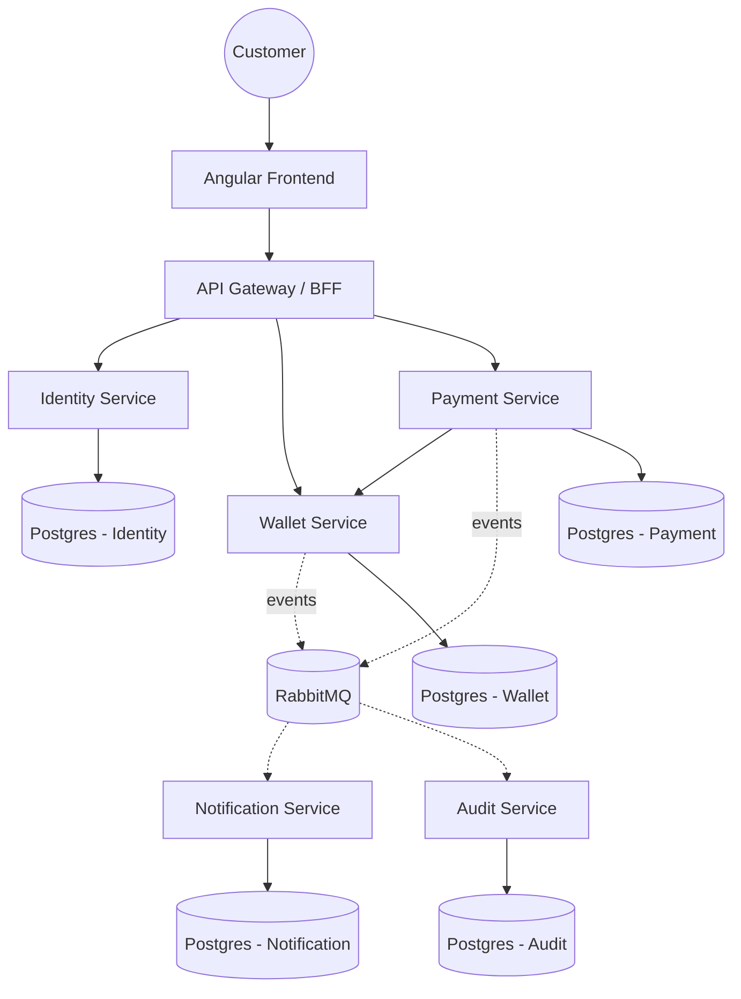

## Container Diagram

One box per deployable, showing network boundaries. Redis is used for Gateway-level rate-limit counters (`Security-Model.md` §6); nothing else in the platform currently depends on it.

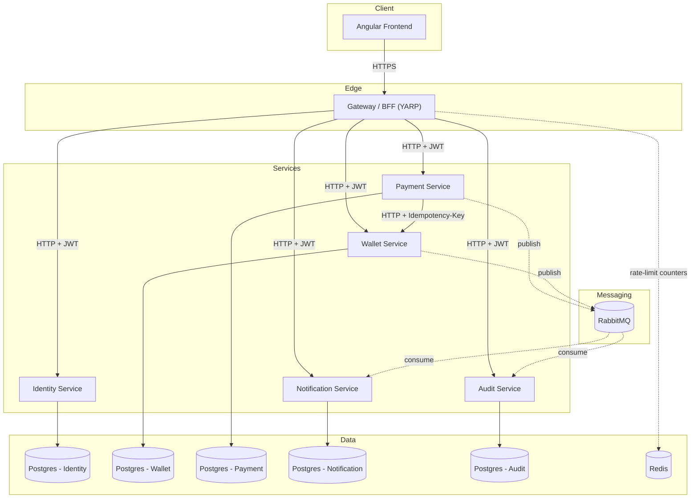

## Component Diagram (per microservice)

Every service follows the same Clean Architecture layering (`Coding-Standards.md`), so one diagram applies structurally to all five — Identity, Wallet, Payment, Notification, and Audit. Service-specific variation: Wallet's Infrastructure layer adds the `RowVersion` optimistic-concurrency check on writes; Payment's Infrastructure layer adds the resilient Wallet HTTP client (Polly); Notification and Audit have no outbound HTTP client at all, since they're pure event consumers with no synchronous callers of their own.

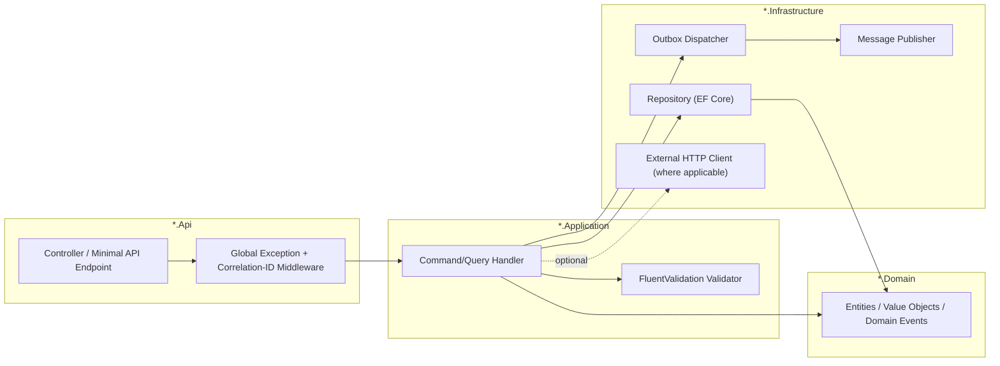

## Deployment Diagram

Kubernetes namespace layout (Phase 3), the pods within each, and the NetworkPolicy-restricted paths between them (Phase 12, Day 61 — default-deny with explicit allows).

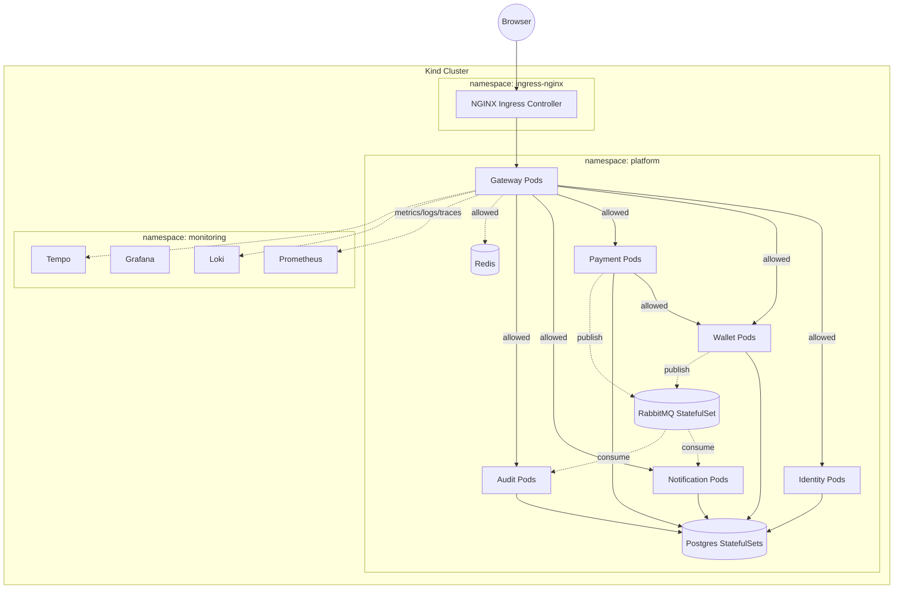

All service-to-service edges not shown (e.g. Identity → Wallet, Notification → Payment) are denied by default — the NetworkPolicy allow-list only covers the paths drawn above, matching the actual call graph in `Microservice-Responsibilities.md`.

## Sequence Diagrams

### Login

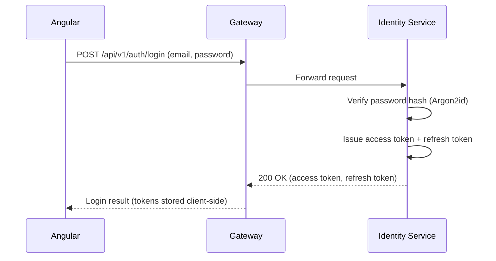

### Payment Flow

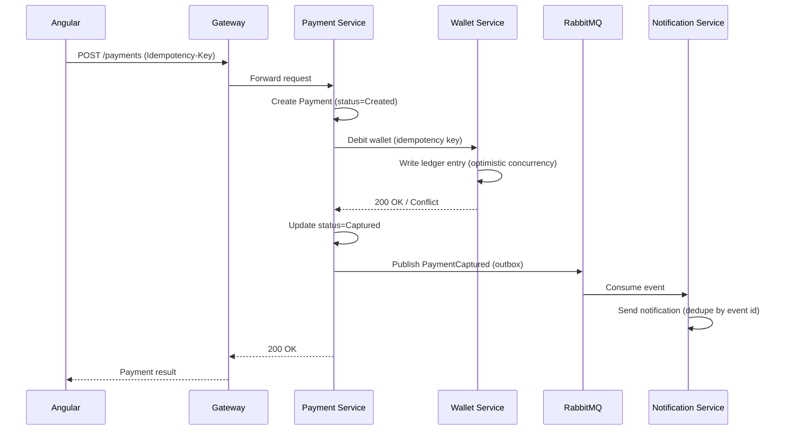

### Wallet Debit (standalone)

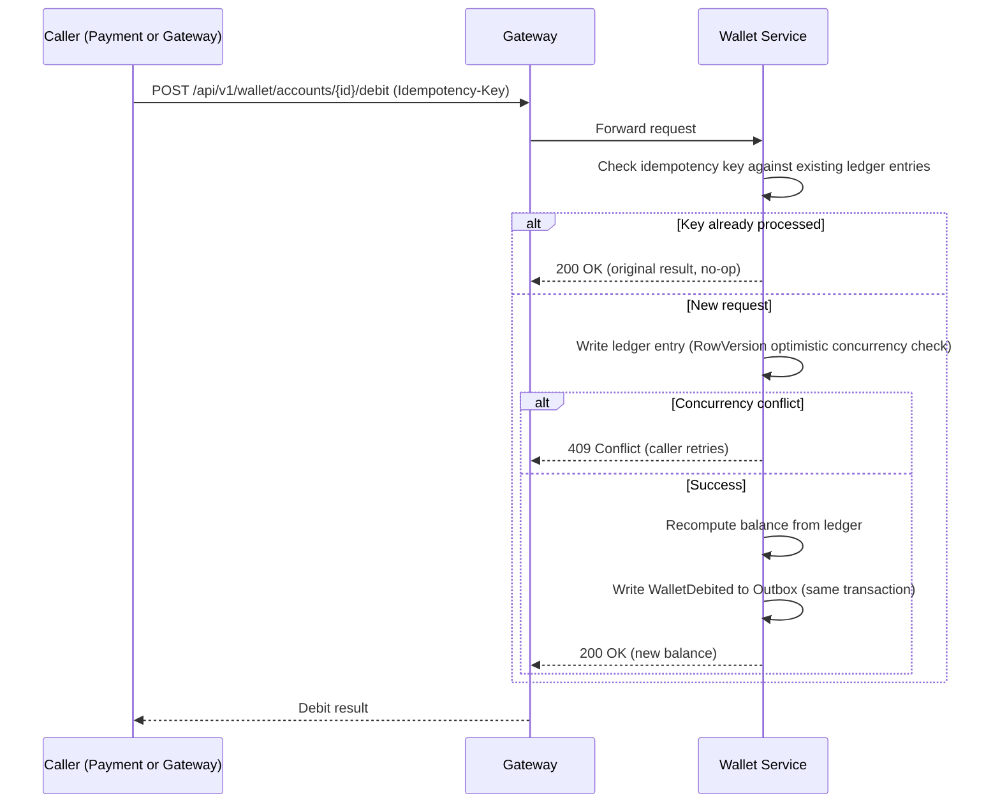

### Refund

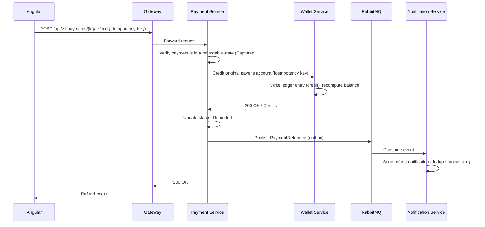

### JWT Refresh

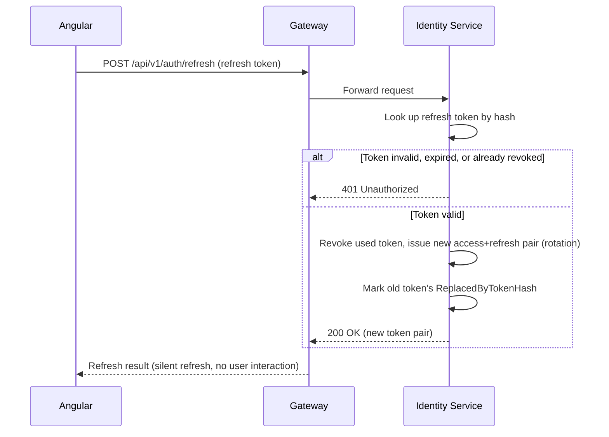

### Notification

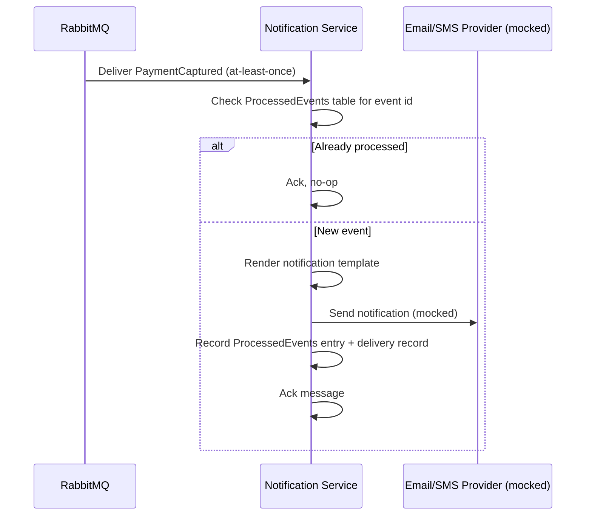

### Audit Logging

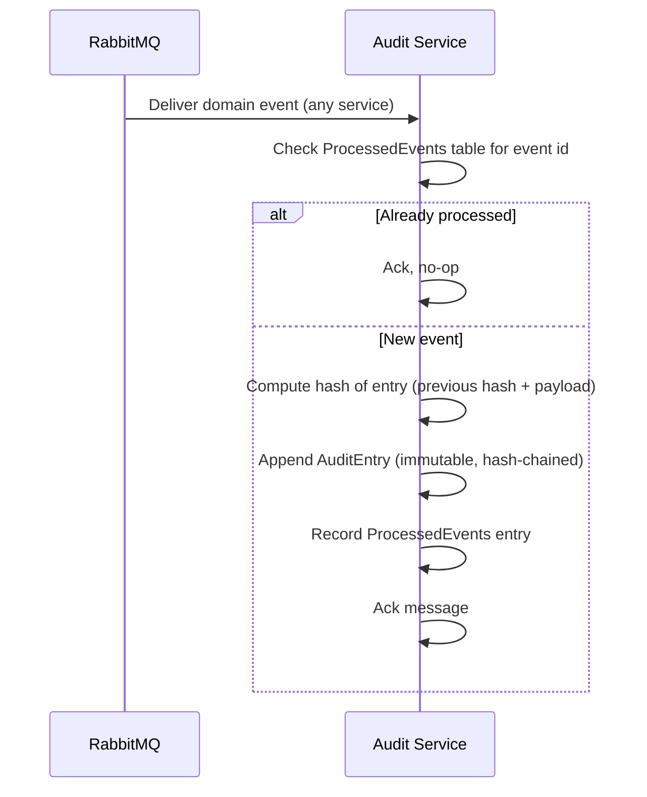

## Design Principles Driving the Architecture

- **Database-per-service** — no shared schema, ever. Cross-service consistency is handled via events, not joins.
- **Money movement is append-only and idempotent** — Wallet never overwrites a balance in place without an idempotency check and optimistic concurrency guard (`RowVersion`); every balance is derivable from its ledger.
- **A saga, not a distributed transaction** — Payment orchestrates multi-step financial workflows explicitly, with defined compensating/failure paths, rather than relying on two-phase commit across services.
- **Independent audit trail** — Audit does not read from other services' databases; it only trusts what came through the event bus, so a bug in another service's direct-write path can't silently corrupt the audit record.
- **Everything crosses the wire with a correlation ID** so a request can be traced end-to-end across Gateway → services → async consumers (see `Logging-Strategy.md` / `Observability-Strategy.md`, written Day 3).

## Status

This document reflects the target architecture agreed at the start of the project (Day 1, Phase 1). No code exists yet. Per Phase 17, this file will be refreshed to match the final as-built system before the project is considered complete.
